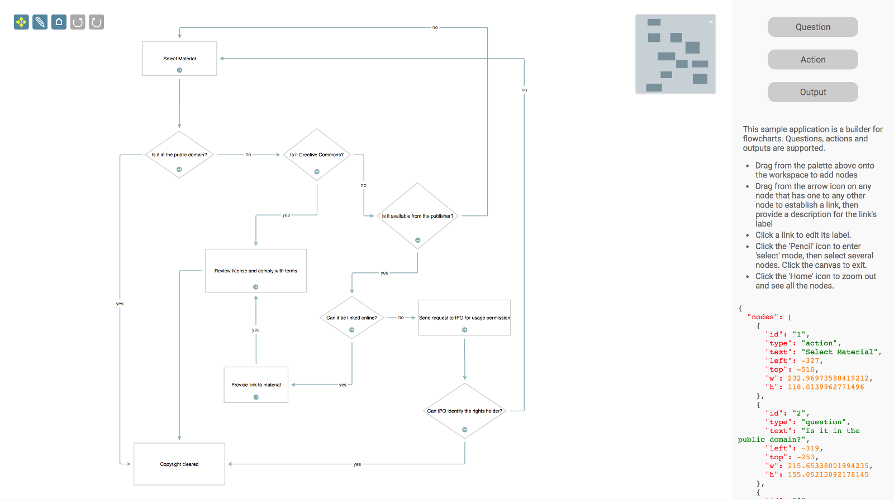
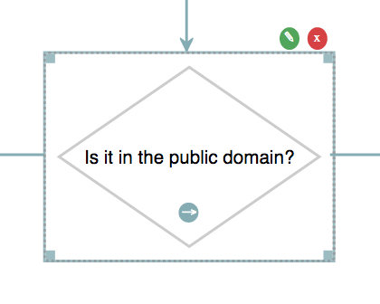
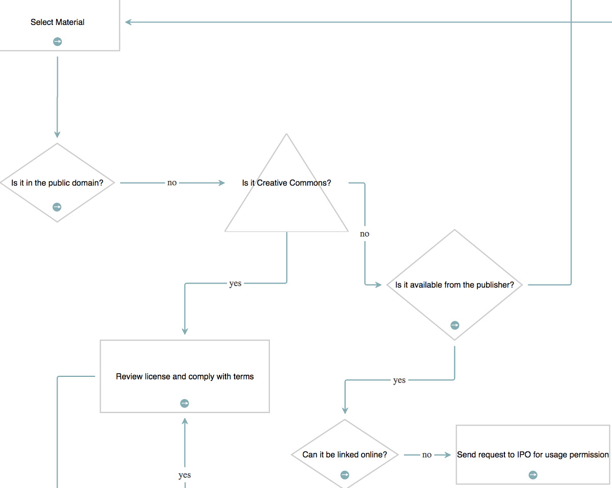

<a name="top"></a>
## Flowchart Builder

This is a simple flowchart builder application, with support for questions, actions and outputs.



This repository contains examples in Typescript, ES6 and ES5. On this page we'll use the Typescript version as a reference.

NOTE: this branch - `templates-2` - uses the `@jsplumbtoolkit/browser-ui-vanilla-2` package, which is new in 5.6.0, and which uses a new template engine, which has a few differences to the original vanilla template engine.

---

<a name="setup"></a>

### Setup

#### CSS

All 3 versions of the demonstration use these CSS imports:


```html
<!-- 
    Contains sane defaults for various core Toolkit widgets. Recommended for inclusion, as least until you can override     everything you need to. 
-->
<link rel="stylesheet" href="node_modules/@jsplumbtoolkit/browser-ui/css/jsplumbtoolkit.css">
<!--
    Styles for the dialogs.
-->
<link rel="stylesheet" href="node_modules/@jsplumbtoolkit/dialogs/css/jsplumbtoolkit-dialogs.css">
<!--
    Sane defaults for the UI artifacts associated with editable connectors. As with `jsplumbtoolkit.css`, we recommend you include this until you've got values set in your own css for everything you need.
-->
<link rel="stylesheet" href="node_modules/@jsplumbtoolkit/connector-editors/css/jsplumbtoolkit-connector-editors.css">
<!--
    Common styles for the Toolkit demo pages. Not needed for your apps.
-->
<link rel="stylesheet" href="node_modules/@jsplumbtoolkit/browser-ui/css/jsplumbtoolkit-demo-support.css">
<!--
    app-specific css. shared by all 3 demonstrations.
-->
<link rel="stylesheet" href="../app.css">
```


#### Imports


These are the jsPlumb specific imports, which are the same across all 3 versions of the demonstration. The contents of `devDependencies` is different between the different versions, as those scripts are what are used to package the demonstration (we use Rollup but you can use any packager of course).

```json
"dependencies": {
    "@jsplumbtoolkit/browser-ui-vanilla-2": "^5.0.0",
    "@jsplumbtoolkit/drop": "^5.0.0",
    "@jsplumbtoolkit/labels": "^5.0.0",
    "@jsplumbtoolkit/print": "^5.0.0",
    "@jsplumbtoolkit/dialogs": "^5.0.0",
    "@jsplumbtoolkit/connector-editors-orthogonal": "^5.0.0",
    "@jsplumbtoolkit/connector-orthogonal": "^5.0.0",
    "@jsplumbtoolkit/browser-ui-plugin-drawing-tools": "^5.0.0",
    "@jsplumbtoolkit/browser-ui-plugin-miniview": "^5.0.0",
    "@jsplumbtoolkit/browser-ui-plugin-lasso": "^5.0.0"
  }
``` 

---

<a name="templates"></a>

### Templates

There are four templates used by the app - one each for the node types of `Question`, `Action` and `Output`, and one 
for the `Start` node. The templates look like this:

**Start**

```xml
<script type="jtk" id="tmplStart">
    <div style="left:{{left}}px;top:{{top}}px;width:{{w}}px;height:{{h}}px;" class="flowchart-object flowchart-start">
        <div style="position:relative">
            <svg:svg width="{{w}}" height="{{h}}">
                <svg:ellipse cx="{{w/2}}" cy="{{h/2}}" rx="{{(w/2) - 10}}" ry="{{(h/2) - 10}}"/>
                <svg:text text-anchor="middle" x="{{ w / 2 }}" y="{{ h / 2 }}" dominant-baseline="central">{{text}}</svg:text>
            </svg:svg>
        </div>
        <div class="drag-start connect" data-jtk-source="true" data-jtk-port-type="source"></div>
    </div>
</script>
```

The **Start** node consists of an ellipse with a text label centered inside of it. Note here how all SVG elements are 
required to be declared in the `svg:` namespace. This is a requirement of Recado, the new version of the vanilla templating engine, and would not necessarily apply if you were using some other template engine.

In this template we can see the `w`, `h`, `left` and `top` values from the node's data being used not just to position 
the element but also to provide appropriate values for the ellipse and text label.

The `.drag-start` element declares, via the `data-jtk-source` attribute, that this node is an edge source, of type `start` (the `data-jtk-port-type` attribute specifies this).

**Action**

```xml
<script type="jtk" id="tmplAction">
    <div style="left:{{left}}px;top:{{top}}px;width:{{w}}px;height:{{h}}px;" class="flowchart-object flowchart-action" data-jtk-target="true" data-jtk-target-port-type="target">
        <div style="position:relative">
            <svg:svg width="{{w}}" height="{{h}}">
                <svg:rect x="10" y="10" width="{{w-20}}" height="{{h-20}}"/>
                <svg:text text-anchor="middle" x="{{w/2}}" y="{{h/2}}" dominant-baseline="central">{{text}}</svg:text>
            </svg:svg>
        </div>
        <div class="node-edit node-action"/>
        <div class="node-delete node-action delete"/>
        <div class="drag-start connect" data-jtk-source="true" data-jtk-port-type="source"></div>
    </div>
</script>
```

Once again we use the position and dimensions for the node's main container as well as its SVG elements. **Action** nodes are configured as targets, via the `data-jtk-target` attribute, with a target port type of `"target"`, which is specified by the value of the `data-jtk-target-port-type` attribute. As with **Start** nodes, there is a `.drag-start` element that acts as a source for connections dragged from the node.

**Question**

```xml
<script type="jtk" id="tmplQuestion">
    <div style="left:{{left}}px;top:{{top}}px;width:{{w}}px;height:{{h}}px;" class="flowchart-object flowchart-question" data-jtk-target="true" data-jtk-target-port-type="target">
        <div style="position:relative">
            <svg:svg width="{{w}}" height="{{h}}">
                <svg:path d="M {{w/2}} 10 L {{w-10}} {{h/2}} L {{w/2}} {{h-10}} L 10 {{h/2}} Z"/>
                <svg:text text-anchor="middle" x="{{w/2}}" y="{{h/2}}" dominant-baseline="central">{{text}}</svg:text>
            </svg:svg>
        </div>
        <div class="node-edit node-action"/>
        <div class="node-delete node-action delete"/>
        <div class="drag-start connect" data-jtk-source="true" data-jtk-port-type="source"></div>
    </div>
</script>
```

The **Question** node differs only from **Action** in that it draws a diamond rather than a rectangle. Connectivity - target/source - is the same as for **Action** nodes.

**Output**

```xml
 <script type="jtk" id="tmplOutput">
     <div style="left:{{left}}px;top:{{top}}px;width:{{w}}px;height:{{h}}px;" class="flowchart-object flowchart-output" data-jtk-target="true" data-jtk-target-port-type="target">
         <div style="position:relative">
             <svg:svg width="{{w}}" height="{{h}}">
                 <svg:rect x="10" y="10" width="{{w-20}}" height="{{h-20}}"/>
                 <svg:text text-anchor="middle" x="{{w/2}}" y="{{h/2}}" dominant-baseline="central">{{text}}</svg:text>
             </svg:svg>
         </div>
         <div class="node-edit node-action"/>
         <div class="node-delete node-action delete"/>
     </div>
 </script>
```

The **Output** node is configured to be a connection target only, again via the `data-jtk-target` and `data-jtk-target-port-type` attributes. 

[TOP](#top)

---

<a name="init"></a>

### Initializing the Toolkit

We use `newInstance` to create a new Toolkit, passing in a `nodeFactory` - a method called when the user drops a new node onto the canvas - and an `edgeFactory` - a method called when the user drags a new edge between two nodes.

```javascript

import { newInstance } from "@jsplumbtoolkit/browser-ui-vanilla-2"}

const toolkit = newInstance({
    nodeFactory: (type:string, data:any, callback:Function) => {
        dialogs.show({
            id: "dlgText",
            title: "Enter " + type + " name:",
            onOK:  (d:any) => {
                data.text = d.text;
                // if the user entered a name...
                if (data.text) {
                    // and it was at least 2 chars
                    if (data.text.length >= 2) {
                        // set an id and continue.
                        data.id = uuid()
                        callback(data);
                    }
                    else
                    // else advise the user.
                        alert(type + " names must be at least 2 characters!");
                }
                // else...do not proceed.
            }
        })

        return true
    },
    edgeFactory:(type:string, data:any, continueCallback:Function, abortCallback:CancelFunction) => {
        showEdgeEditDialog(data, continueCallback, abortCallback)
        return true
    },
    beforeStartConnect:(node:Vertex, edgeType:string) => {
        // limit edges from start node to 1. if any other type of node, return a payload for the edge.
        // if there is already a label set for the edge (say, if it was connected programmatically or via
        // edge undo/redo), this label is ignored.
        return (node.data.type === START && node.getEdges().length > 0) ? false : { label:"..." }
    }
});
```

`showEdgeEditDialog` is a helper method used both by the `edgeFactory` above and also when the user clicks an edge to edit it (see below).

```javascript
function showEdgeEditDialog(data:ObjectData, continueFunction:Function, abortFunction?:CancelFunction) {
    dialogs.show({
        id: "dlgText",
        data: {
            text: data.label || ""
        },
        onOK: (data:any) => {
            //toolkit.updateEdge(edge, )
            continueFunction({ label:data.text || "" })
        },
        onCancel:abortFunction
    })
}
```

[TOP](#top)

---


<a name="loading"></a>

### Data Loading

Data for this application is stored in `data/copyright.json` inside the application folder. It is loaded by this code:

```javascript
toolkit.load({
    url: "./copyright.json",
    onload:function() {
        renderer.zoomToFit()
    }
})
```

[TOP](#top)

---

<a name="dragging"></a>

### Dragging New Nodes

This is how we configure a Surface Drop Manager in this demonstration:

```javascript

import { createSurfaceManager } from "@jsplumbtoolkit/drop"

const nodePalette = mainElement.querySelector(".node-palette")

createSurfaceManager({
    source:nodePalette,
    selector:"div",
    dataGenerator: function (el) {
        return {
            w: parseInt(el.getAttribute('data-width'), 10),
            h: parseInt(el.getAttribute('data-height'), 10),
            type: el.getAttribute("data-node-type")
        }
    },
    surface:renderer
})
```

- **source** The element containing the draggables. Required.
- **selector** A CSS3 selector identifying the draggable items inside `source`. Required.
- **surface** The Surface widget to attach to. Required.
- **dataGenerator** This function is used by the Toolkit to generate an initial dataset for a Node you have begun to drag. Required.

`SurfaceDropManager` is an extension of the Drop Manager which provides default implementations for the various drop functions. By default, the Surface Drop Manager is configured to allow nodes/groups to be dropped onto the canvas or an existing edge, and for nodes to be dropped on groups.

Note that `SurfaceDropManager` uses a delegated drag handler, so the contents of the element acting as the container for draggables can be arbitrarily updated by your code without needing to inform the drop manager of the changes - it will track them automatically.


[TOP](#top)
---

<a name="behaviour"></a>
### Behaviour

The Toolkit publishes a long list of events during the rendering lifecycle - `nodeAdded`, `edgeAdded`, etc - all of which can be 
subscribed to from within a palette definition. But for your app's behaviour, it is better to use event delegation and configure 
all of your event listeners in one place. In the Flowchart Builder there are a few pieces of behaviour that we need to code that 
are not completely handled for us by the Toolkit:

- Enter path edit mode
- Edit node text
- Edit path label
- Delete node
- Remove edge

We'll go through each of these and provide a brief code snippet highlighting the main points.

<a name="edit-node-text"></a>
#### Edit Node Text

```javascript
renderer.bindModelEvent(EVENT_TAP, ".node-edit", (event:Event, eventTarget:HTMLElement, info:SurfaceObjectInfo<Vertex>) => {
    dialogs.show({
        id: "dlgText",
        data: info.obj.data,
        title: "Edit " + info.obj.data.type + " name",
        onOK: (data:any) => {
            if (data.text && data.text.length > 2) {
                // if name is at least 2 chars long, update the underlying data and
                // update the UI.
                toolkit.updateNode(info.obj, data)
            }
        }
    })
})
```

Note here the `bindModelEvent` method: this is method with which you will want to acquaint yourself. It is defined on a Surface, not on a Toolkit instance, and takes a CSS3 selector as argument. When an event with the bound name (in this case "tap") occurs on a child element of some node/group whose selector matches the one given, `bindModelEvent` hits your supplied callback, passing the original event, the specific DOM element the event occurred on, and an `info` object 

- **id** ID of the Toolkit object
- **obj** The associated Toolkit object. May be a Node or a Port.
- **el** The DOM element for the Toolkit object
- **type** The type of the Toolkit object. This will be "Node" or "Port".

In this event handler, we show the user a dialog that will allow them to edit the Node's text. If the edited text is at 
least two character long we update the model.

This application uses the `@jsplumbtoolkit/dialogs` to manage simple interactions with data members such as 
this. Your application may choose to use a different mechanism.

<a name="delete-node"></a>
#### Delete Node

```javascript
renderer.bindModelEvent(EVENT_TAP, ".node-delete",  (event:Event, eventTarget:HTMLElement, info:ObjectInfo<Vertex>) => {
    dialogs.show({
        id: "dlgConfirm",
        data: {
            msg: "Delete '" + info.obj.data.text + "'"
        },
        onOK: function () {
            toolkit.removeNode(info.obj)
        }
    })
})
```

We use `bindModelEvent` again to bind to an event on a `.node-delete` child element of a node, and then we prompt the user to see if they wish to delete it. If the users answers yes, then we call `removeNode` on the Toolkit, passing in the ID of the object to delete. This will cause all Edges associated with the Node to be deleted, and for the UI to be updated accordingly.

<a name="edit-edge-path"></a>
#### Edit Edge Path

To edit the paths of the edges, we make use of an "orthogonal connector editor", which is supplied in the `@jsplumbtoolkit/connector-editors-orthogonal` package. To set this up we have to import it and initialise it manually:

```javascript
import * as ConnectorEditorOrthogonal from "@jsplumbtoolkit/connector-editors-orthogonal"
ConnectorEditorOrthogonal.initialize()
```

This is required because the orthogonal connector editor is registered by name on the edge edit manager, and without a specific call to it, the build mechanism would not pull the editor code in.

Having registered the orthogonal editor, an edge editor is created further down in the code (it is given the Surface to attach to as argument):

```javascript
const edgeEditor = new EdgePathEditor(renderer)
```

Now to edit an edge, we register a `click` listener on edges by providing it as an event handler to the View, on the edge type that acts as the parent type for all others:


```javascript
...
edges: {
    [DEFAULT]: {
        anchor:AnchorLocations.AutoDefault,
        endpoint:BlankEndpoint.type,
        connector: {type:OrthogonalConnector.type, options:{ cornerRadius: 3 } },
        paintStyle: { strokeWidth: 2, stroke: "rgb(132, 172, 179)", outlineWidth: 3, outlineStroke: "transparent" },	//	paint style for this edge type.
        hoverPaintStyle: { strokeWidth: 2, stroke: "rgb(67,67,67)" }, // hover paint style for this edge type.
        events: {
            click:(p:any) => {
                edgeEditor.startEditing(p.edge, {
                    deleteButton:true,
                    onMaybeDelete:(edge:Edge, connection:Connection, doDelete:(data:Record<string, any>)=>any) => {
                        dialogs.show({
                            id: "dlgConfirm",
                            data: {
                                msg: "Delete Edge"
                            },
                            onOK: doDelete
                        });
                    }
                })
            }
        },
        overlays: [
            { type:ArrowOverlay.type, options:{ location: 1, width: 10, length: 10 }}
        ]
    }

...
```

This event handler calls `startEditing(..)` with the edge that was clicked on. The user can then make changes to the edge path, and this mode stays active until the user either clicks on some whitespace, or clicks on some other edge.

<a name="exit-path-edit-mode"></a>

#### Exiting path edit mode

In this application we listen to clicks on the whitespace in the Surface widget and switch off path edit mode when we detect a click.  This is the `events` 
argument to the `render` call:

```javascript
events: {
  [EVENT_CANVAS_CLICK]:  (e:Event) => {
      toolkit.clearSelection();
      edgeEditor.stopEditing();
  }
}
```

Note also that the `canvasClick` handler clears the current selection - this is discussed below.

<a name="remove-edge"></a>
#### Removing edges

The `click` listener added to the edge uses the `startEditing(..)` method to put the edge into path edit mode.  This method supports the addition of arbitrary overlays to the edge when in path edit mode, as well as a shortcut "deleteButton" helper to add an overlay which will, when clicked, cause the edge to be removed.  

<a name="edit-edge-label"></a>
#### Editing edge labels

All Edges except those from a *Start* node are set to be of type `"response"`, which is defined in the view as follows:

```javascript

const RESPONSE = "response"

[RESPONSE]:{
    parent:DEFAULT,
    overlays:[
        {
            type: LabelOverlay.type,
            options: {
                label: "${label}",
                events: {
                    click: (params:any) => {
                        _editLabel(params.edge);
                    }
                }
            }
        }
    ]
}
```

We define a `click` event handler on the Label overlay which edits the label for the Edge.

The `_editLabel` method that is called looks like this:

```javascript
const _editLabel = (edge:Edge, deleteOnCancel?:boolean) => {
    dialogs.show({
        id: "dlgText",
        data: {
            text: edge.data.label || ""
        },
        onOK: (data:any) => {
            toolkit.updateEdge(edge, { label:data.text || "" })
        },
        onCancel:() => {
            if (deleteOnCancel) {
                toolkit.removeEdge(edge)
            }
        }
    })
}
```

the method could have been declared directly inside the view but was pulled out for clarity.

[TOP](#top)

---

<a name="undo-redo"></a>
### Undo/Redo

In this demonstration it is possible to undo/redo the addition or removal of nodes and edges, as well as the editing of edge paths. In version 5.x of the Toolkit, undo/redo is baked into the core.

After creating our instance of the Toolkit we bind a few event listeners to help us respond to the undo/redo buttons in the UI.

```javascript
toolkit.bind(EVENT_UNDOREDO_UPDATE, (state:UndoRedoUpdateParams) => {
    controls.setAttribute("can-undo", state.undoCount > 0 ? "true" : "false")
    controls.setAttribute("can-redo", state.redoCount > 0 ? "true" : "false")
})

renderer.on(controls, EVENT_TAP, "[undo]",  () => {
    toolkit.undo()
})

renderer.on(controls, EVENT_TAP, "[redo]", () => {
    toolkit.redo()
})
```

The `controls` element referred to here looks like this in the HTML:

```html
<div class="controls">
    <i class="fa fa-arrows selected-mode" mode="pan" title="Pan Mode"></i>
    <i class="fa fa-pencil" mode="select" title="Select Mode"></i>
    <i class="fa fa-home" reset title="Zoom To Fit"></i>
    <i class="fa fa-undo" undo title="Undo last action"></i>
    <i class="fa fa-repeat" redo title="Redo last action"></i>
</div>
```

The last two items in this list are our `undo` and `redo` buttons - we declared an appropriate attribute with which to identify each button, and then we bind to tap events on those buttons.

---

<a name="resizedrag"></a>
### Resizing Nodes

To resize a node you must first either click on it, or use the lasso (described [below](#selecting)) to select it.  A selected node looks like this:



The dotted line and drag handles that are added to a selected Node are put there by the Toolkit's drawing tools. It listens to the Toolkit's select/deselect events and decorates UI elements accordingly. These tools are in the package `@jsplumbtoolkit/browser-ui-plugin-drawing-tools`, and as the name suggests, are a plugin for the Surface.

The drawing tools are initialized by being included in the list of plugins for the `render` call:

```javascript
import {DrawingToolsPlugin} from "@jsplumbtoolkit/browser-ui-plugin-drawing-tools"

toolkit.render(canvasElement, {
    ...
    plugins:[
        {
            type: MiniviewPlugin.type,
            options: {
                container: miniviewElement
            }
        },
        DrawingToolsPlugin.type,
        {
            type:LassoPlugin.type,
            options: {
                lassoInvert:true,
                lassoEdges:true
            }
        }
    ],
})


```


Resizing is handled automatically by the drawing tools.  By default, these tools will change the `w`, `h`, `left` and `top` values in a node's data, but this can be changed.

When a node's data is updated the drawing tools call the appropriate update method on the underlying Toolkit. 

[TOP](#top)

---

<a name="selecting"></a>
### Selecting Nodes

<a name="selecting-left-click"></a>
#### Selecting with left click/tap

Nodes can be selected with a left-click (or tap on a touch device; `tap` is a better event to choose in general because the Toolkit abstracts out the difference between mouse devices and touch devices and presents `click` events as `tap` events on non touch devices).  This is configured in the `view` parameter to the `render` call. In this application, nodes of type _selectable_ have the capability enabled with this code:

```javascript
[SELECTABLE]: {
    events: {
        tap: (params:{obj:Vertex}) => {
            toolkit.toggleSelection(params.obj);
        }
    }
}
```

The `tap` event is preferable to `click`, as it ensures the application responds only to true clicks on devices with a mouse, and also avoids the delay that some vendors introduce to a click event on touch devices.

<a name="selecting-lasso"></a>
#### Selecting with lasso

Lasso selection is provided by a plugin on the Surface widget.

```javascript
plugins:[
        ...
        {
            type:LassoPlugin.type,
            options: {
                lassoInvert:true,
                lassoEdges:true
            }
        }
    ]
```

To activate the lasso, click the pencil icon in the toolbar:


The code that listens to clicks on this icon is as follows:

```javascript
renderer.bind(EVENT_SURFACE_MODE_CHANGED, (mode:string) => {
    forEach(controls.querySelectorAll("[mode]"), (e:Element) => {
        renderer.removeClass(e, "selected-mode")
    })

    renderer.addClass(controls.querySelector("[mode='" + mode + "']"), "selected-mode")
})

// pan mode/select mode
renderer.on(controls, EVENT_TAP, "[mode]", (e:Event, eventTarget:HTMLElement) => {
    renderer.setMode(eventTarget.getAttribute("mode") as SurfaceMode)
});
```

Here we've registered an event listener to be informed when the Surface's mode has changed; it is responsible for setting the appropriate classes on the toolbar items.  The click listener extracts the desired mode from the button that was clicked and sets it on the renderer.

<a name="selecting-lasso-operation"></a>
##### Lasso operation

The lasso works in two ways: when you drag from left to right, any node that intersects your lasso will be selected.  When you drag from right to left, only nodes that are enclosed by your lasso will be selected.


Note that in this demo we also set `lassoInvert:true` on our `render` call, which results in a lasso that masks unselected parts of the UI (which is in contrast to the default mode of operation, in which the lasso draws an element corresponding to selected parts of the UI).

<a name="exit-select-mode"></a>
##### Exiting select mode

The Surface widget automatically exits select mode once the user has selected something. In this application we also listen to clicks on the whitespace in the widget and switch back to pan mode when we detect one.  This is the `events` argument to the `render` call (as shown above in the section on exiting path edit mode):

```javascript
events: {
    [EVENT_CANVAS_CLICK]: (e:Event) => {
        toolkit.clearSelection()
        edgeEditor.stopEditing()
    }
}
```

`clearSelection` clears the current selection and switches back to Pan mode.

[TOP](#top)

---

<a name="dialogs"></a>
### Dialogs

This demonstration uses the `@jsplumbtoolkit/dialogs` package, which are a lightweight dialog solution created for use by the Toolkit demonstrations but are made available to licensees. The dialogs are initialised like this:

```javascript

import * as Dialogs from "@jsplumbtoolkit/dialogs"

const dialogs = Dialogs.newInstance({
    dialogs: {
        "dlgText": {
            template: '<input type="text" size="50" jtk-focus jtk-att="text" value="${text}" jtk-commit="true"/>',
            title: 'Enter Text',
            cancelable: true
        },
        "dlgConfirm":{
            template:'${msg}',
            title:'Please Confirm',
            cancelable:true
        },
        "dlgMessage": {
            template:'${msg}',
            title:"Message",
            cancelable:false
        }
    }
});
```

Each dialog declaration consists of the template to use, its title, and whether or not the dialog should have a cancel button.

#### Dialog Templates

##### Binding Parameters

These templates use the same template engine as the Surface renderer. Not, in the `input` field above, the `jtk-att` attribute: it tells the dialog handler that the value of this textarea should be passed to the OK handler, using the key `text`, and also that it should be populated from the incoming data.

Note also in the above example, the `jtk-focus` attribute: this tells the dialog handler that the textarea should be given the focus when the dialog first opens.

#### Showing a dialog

This example is the dialog that is shown when you edit a View query. We provide the id of the template to use for the dialog, and we provide the View node's data as the backing data for the dialog. Then we provide an `onOK` callback:

```javascript
dialogs.show({
  id:"dlgViewQuery",
  data:info.obj.data,
  onOK:function(data) {
    // update data
    toolkit.updateNode(info.obj, data);
    // update UI	        		
    info.el.querySelectorAll(".view-details")[0].innerHTML = data.query;
  }
});
```

The `data` argument to the `onOK` callback consists of an object whose key value pairs are determined by the `jtk-att` attributes found in the template. Recall that above we had a textarea with `jtk-att:"query"`. This means that the `data` argument to `onOK` looks like this:

```javascript
{
  query:"the contents of the text area"
}
```

##### Supported Input Types

The list of supported input types is:

- text
- radio button(s) 
- checkbox
- select
- textarea

##### Dialog Titles

If you set a `title` attribute on a dialog's template, that value will be used for the title of the dialog. Alternatively, you can provide a `title` parameter to the `show` call.

##### Lifecycle Callbacks

There are three lifecycle callbacks supported:

- **onOpen** Called when the dialog has been opened. The related DOM element for the dialog is passed to this method.
- **onOK** Called when the user presses OK. The callback is provided a data object as discussed above.
- **onCancel** Called when the user presses cancel. No arguments are provided to the callback.


[TOP](#top)

---

<a name="adding-node-type"></a>
### Adding a new node type

If you're using this demo as a starting point for your own app, perhaps you are wondering how you'd go about adding a new
type of node.  The process is straightforward. Let's add support for nodes with type `uncertainty`. 

#### 1. Create node template

Our new node type will be rendered as a triangle. In this demo the general form of each template is of a container
div that contains an SVG element, with the node's shape being drawn via SVG. So our `uncertainty` node is almost
identical to a `question` node, with the only differences being the SVG `path` elements (and a CSS class):

```xml
<script type="jtk" id="tmplUncertainty">
    <div style="left:{{left}}px;top:{{top}}px;width:{{w}}px;height:{{h}}px;" class="flowchart-object flowchart-question" data-jtk-target="true" data-jtk-target-port-type="target">
        <div style="position:relative">
            <div class="node-edit node-action">
                <i class="fa fa-pencil-square-o"/>
            </div>
            <div class="node-delete node-action">
                <i class="fa fa-times"/>
            </div>
            <svg:svg width="{{w}}" height="{{h}}">
                <svg:path d="M {{w/2}} 0 L {{w}} {{h}} L 0 {{h}} L {{w/2}} 0 Z" class="outer"/>
                <svg:text text-anchor="middle" x="{{w/2}}" y="{{h/2}}" dominant-baseline="central">{{text}}</svg:text>
            </svg:svg>
        </div>
        <div class="drag-start connect" data-jtk-source="true" data-jtk-port-type="source"></div>
    </div>
</script>
```

#### 2. Map the new type in your view

```javascript
const UNCERTAINTY = "uncertainty"

const renderer:Surface = toolkit.render(canvasElement, {
    view: {
        nodes: {
            [START]: {
                templateId: "tmplStart"
            },
            [SELECTABLE]: {
                events: {
                    tap: (params:{obj:Vertex}) => {
                        toolkit.toggleSelection(params.obj);
                    }
                }
            },
            [QUESTION]: {
                parent: SELECTABLE,
                templateId: "tmplQuestion"
            },
            [ACTION]: {
                parent: SELECTABLE,
                templateId: "tmplAction"
            },
            [OUTPUT]:{
                parent:SELECTABLE,
                templateId:"tmplOutput"
            },
            [UNCERTAINTY]:{
                parent:SELECTABLE,
                templateId:"tmplUncertainty"
            }
        }
        ... 
    }
    ...
}
```

Note here we said that this new node type's template should extend `selectable`, which `action` and `question` and `output` all do, but `start` does not. We didn't have to extend `selectable` if we didn't want to, but it gives us the tap to select functionality for this new type.

##### Changes to the data

For reference, here's how you'd represent a node of this new type in your data (we've changed the existing `Is it Creative Commons?` node here to be of our new type):

```javascript
{
    "id": "decide",
    "type": "uncertainty",
    "text": "New Type",
    "left": 660,
    "top": 187,
    "w": 120,
    "h": 120
}
```

With these few changes you get this output:


