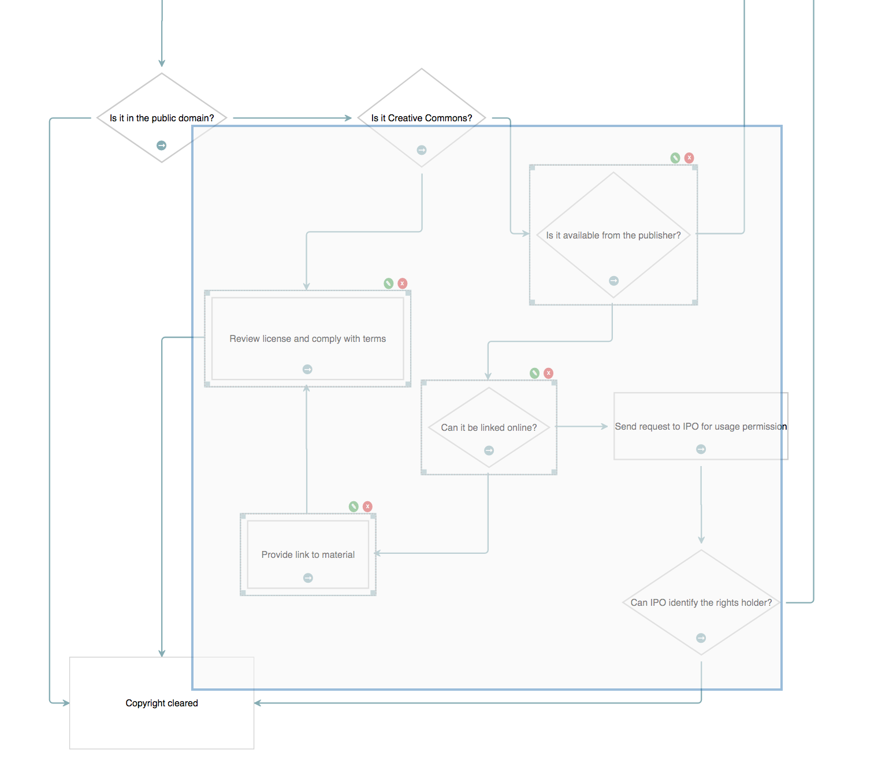

<a name="top"></a>
## Flowchart Builder

This is a simple flowchart builder application, with support for questions, actions and outputs.


This page gives you an in-depth look at how the application is put together. As of version 2.0.0, this demonstration uses the
`EditableFlowchart` connector, which allows you to manipulate the paths that the edges follow.

---

<a name="setup"></a>

### Page Setup

#### CSS

- **jsplumbtoolkit.css**     Contains sane defaults for various core Toolkit widgets. Recommended for inclusion, as least until you can override everything you need to. 
- **jsplumbtoolkit-demo-support.css**      Common styles for the Toolkit demo pages. Not needed for your apps.
- **jsplumbtoolkit-syntax-highlighter.css**  Styles for the syntax highlighter widget used in the demonstration.
- **jsplumbtoolkit-editable-connectors.css**  Sane defaults for the UI artifacts associated with editable connectors. As with `jsplumbtoolkit.css`, we recommend you include this until you've got values set in your own css for everything you need.
- **app.css**  Styles for this demonstration.

#### JS

- **jsplumbtoolkit.js**          Core jsPlumb Toolkit code.
- **jsplumbtoolkit-drop.js**     Drag/drop library, used in this demo to handle dragging new nodes onto the canvas.
- **jsplumbtoolkit-syntax-highlighter.js**  Used in this demo by the code that displays the current dataset.
- **jsplumbtoolkit-editable-connectors.js** The editable flowchart connectors code.
- **app.js** Application specific JS.

With the exception of `app.css` and `app.js` each of these is loaded from a package with the same name.

---

<a name="templates"></a>

### Templates

There are four templates used by the app - one each for the node types of `Question`, `Action` and `Output`, and one 
for the `Start` node. These are contained in the `templates.html` file, which is imported into the page via this
script tag:

```xml
<script type="text/x-jtk-templates" src="templates.html"></script>
```

The templates look like this:

**Start**

```xml
<script type="jtk" id="tmplStart">
    <div style="left:${left}px;top:${top}px;width:${w}px;height:${h}px;" class="flowchart-object flowchart-start">
        <div style="position:relative">
            <svg:svg width="${w}" height="${h}">
                <svg:ellipse cx="${w/2}" cy="${h/2}" rx="${(w/2) - 10}" ry="${(h/2) - 10}"/>
                <svg:text text-anchor="middle" x="${ w / 2 }" y="${ h / 2 }" dominant-baseline="central">${text}</svg:text>
            </svg:svg>
        </div>
        <div class="drag-start connect"></div>
        <jtk-source port-type="start" filter=".connect"/>
    </div>
</script>
```

The **Start** node consists of an ellipse with a text label centered inside of it. Note here how all SVG elements are 
required to be declared in the `svg:` namespace. This is a requirement of [Knockle](templating#knockle) and would not 
necessarily apply if you were using some other template engine.

In this template we can see the `w`, `h`, `left` and `top` values from the node's data being used not just to position 
the element but also to provide appropriate values for the ellipse and text label.

The `jtk-source` element declares that this node is an edge source, of type `start` (the `port-type` attribute specifies 
this).  The `filter` attribute instructs the Toolkit to enable drag only from some element having class "connect".

**Action**

```xml
<script type="jtk" id="tmplAction">
    <div style="left:${left}px;top:${top}px;width:${w}px;height:${h}px;" class="flowchart-object flowchart-action">
        <div style="position:relative">
            <svg:svg width="${w}" height="${h}">
                <svg:rect x="10" y="10" width="${w-20}" height="${h-20}"/>
                <svg:text text-anchor="middle" x="${w/2}" y="${h/2}" dominant-baseline="central">${text}</svg:text>
            </svg:svg>
        </div>
        <div class="node-edit node-action"/>
        <div class="node-delete node-action delete"/>
        <div class="drag-start connect"></div>
        <jtk-target port-type="target"/>
        <jtk-source port-type="source" filter=".connect"/>
    </div>
</script>
```

Once again we use the position and dimensions for the node's main container as well as its SVG elements. **Action** nodes 
are configured as both edge sources and targets.

**Question**

```xml
<script type="jtk" id="tmplQuestion">
    <div style="left:${left}px;top:${top}px;width:${w}px;height:${h}px;" class="flowchart-object flowchart-question">
        <div style="position:relative">
            <svg:svg width="${w}" height="${h}">
                <svg:path d="M ${w/2} 10 L ${w-10} ${h/2} L ${w/2} ${h-10} L 10 ${h/2} Z"/>
                <svg:text text-anchor="middle" x="${w/2}" y="${h/2}" dominant-baseline="central">${text}</svg:text>
            </svg:svg>
        </div>
        <div class="node-edit node-action"/>
        <div class="node-delete node-action delete"/>
        <div class="drag-start connect"></div>
        <jtk-source port-type="source" filter=".connect"/>
        <jtk-target port-type="target"/>
    </div>
</script>
```

The **Question** node differs only from **Action** in that it draws a diamond rather than a rectangle.

**Output**

```xml
 <script type="jtk" id="tmplOutput">
     <div style="left:${left}px;top:${top}px;width:${w}px;height:${h}px;" class="flowchart-object flowchart-output">
         <div style="position:relative">
             <svg:svg width="${w}" height="${h}">
                 <svg:rect x="10" y="10" width="${w-20}" height="${h-20}"/>
                 <svg:text text-anchor="middle" x="${w/2}" y="${h/2}" dominant-baseline="central">${text}</svg:text>
             </svg:svg>
         </div>
         <div class="node-edit node-action"/>
         <div class="node-delete node-action delete"/>
         <jtk-target port-type="target"/>
     </div>
 </script>
```

The `Output` node is configured to be a connection target only.

[TOP](#top)

---

<a name="loading"></a>

### Data Loading

Data for this application is stored in `data/copyright.json` inside the application folder. It is loaded by this code:

```javascript
toolkit.load({
  url: "data/copyright.json"
});
```

[TOP](#top)

---

<a name="dragging"></a>

### Dragging New Nodes

This is how we configure a Surface Drop Manager in this demonstration:

```javascript
new SurfaceDropManager({
    source:nodePalette,
    selector:"div",
    surface:renderer,
    dataGenerator: function (el) {
        return {
            w:140,
            h:140,
            type:el.getAttribute("data-node-type")
        };
     }
});
```

- **source** The element containing the draggables. Required.
- **selector** A CSS3 selector identifying the draggable items inside `source`. Required.
- **surface** The Surface widget to attach to. Required.
- **dataGenerator** This function is used by the Toolkit to generate an initial dataset for a Node you have begun to drag. Required.
whenever a new node is dropped on whitespace.

`SurfaceDropManager` is an extension of the [Drop Manager](drop-manager) which provides default implementations for the various drop functions. By default, the Surface Drop Manager is configured to allow nodes/groups to be dropped onto the canvas or an existing edge, and for nodes to be dropped on groups. Detailed documentation can be found [on this page](surface-drop-manager).

Note that `SurfaceDropManager` uses a delegated drag handler, so the contents of the element acting as the container for draggables can be arbitrarily updated by your code without needing to inform the drop manager of the changes - it will track them automatically.


[TOP](#top)
---

<a name="behaviour"></a>
### Behaviour

The Toolkit publishes a long list of events during the rendering lifecycle - `nodeAdded`, `edgeAdded`, etc - all of which can be 
subscribed to from within a palette definition. But for your app's behaviour, it is better to use event delegation and configure 
all of your event listeners in one place. In the Flowchart Builder there are a few pieces of behaviour that we need to code that 
are not completely handled for us by the Toolkit:

- Enter path edit mode
- Edit node text
- Edit path label
- Delete node
- Remove edge

We'll go through each of these and provide a brief code snippet highlighting the main points.

<a name="edit-node-text"></a>
#### Edit Node Text

```javascript
jsPlumb.on(document, "tap", ".node-edit", function () {
  var info = renderer.getObjectInfo(this);
  jsPlumbToolkit.Dialogs.show({
    id: "dlgText",
    data: info.obj.data,
    title: "Edit " + info.obj.data.type + " name",
    onOK: function (data) {
      if (data.text && data.text.length > 2) {
        // if name is at least 2 chars long, update the underlying data and update the UI.
        toolkit.updateNode(info.obj, data);
      }
    }
  });
});
```

Note here the `getObjectInfo` method: this is method with which you will want to acquaint yourself. It is defined on a 
Surface, not on a Toolkit instance, and takes a DOM element as argument and places it within the context of some object 
managed by the Toolkit instance that the Surface is associated with. In this case, the click event occurs on an icon. 
`getObjectInfo` traverses up the icon's ancestors until it finds an element that is associated with a Toolkit object. When 
a Toolkit object is found, getObjectInfo returns an object with these values:

- **id** ID of the Toolkit object
- **obj** The associated Toolkit object. May be a Node or a Port.
- **el** The DOM element for the Toolkit object
- **type** The type of the Toolkit object. This will be "Node" or "Port".

In this event handler, we show the user a dialog that will allow them to edit the Node's text. If the edited text is at 
least two character long we update the model.

This application uses the Toolkit's [dialogs](dialogs) import to manage simple interactions with data members such as 
this. Your application may choose to use a different mechanism.

<a name="delete-node"></a>
#### Delete Node

```javascript
jsPlumb.on(document, "tap", ".node-delete", function () {
  var info = renderer.getObjectInfo(this);
  jsPlumbToolkit.Dialogs.show({
    id: "dlgConfirm",
    data: {
      msg: "Delete '" + info.obj.data.text + "'"
    },
    onOK: function () {
      toolkit.removeNode(info.obj);
    }
  });
});
```

We use `getObjectInfo` again to find the related Toolkit Node, and then we prompt the user to see if they wish to delete 
it. If the users answers yes, then we call `removeNode` on the Toolkit, passing in the ID of the object to delete. This 
will cause all Edges associated with the Node to be deleted, and for the UI to be updated accordingly.

<a name="edit-edge-path"></a>
#### Edit Edge Path

We register a `click` listener on edges by providing it as an event handler to the View, on the edge type that acts 
as the parent type for all others:


```javascript
...
edges: {
  "default": {
      editable:true,
      anchor:"AutoDefault",
      endpoint:"Blank",
      connector: ["EditableFlowchart", { cornerRadius: 3 } ],
      paintStyle: { strokeWidth: 2, stroke: "rgb(132, 172, 179)", outlineWidth: 3, outlineStroke: "transparent" },	//	paint style for this edge type.
      hoverPaintStyle: { strokeWidth: 2, stroke: "rgb(67,67,67)" }, // hover paint style for this edge type.
      events: {
          click:function(p) {
              renderer.startEditing(p.edge, {
                  deleteButton:true,
                  onMaybeDelete:function(edge, connection, doDelete) {
                      jsPlumbToolkit.Dialogs.show({
                          id: "dlgConfirm",
                          data: {
                              msg: "Delete Edge"
                          },
                          onOK: doDelete
                      });
                  }
              });
          }
      },
      overlays: [
          [ "Arrow", { location: 1, width: 10, length: 10 }]
      ]
  }

...
```

This event handler calls `startEditing(..)` with the edge that was clicked on. The user can then make changes to the edge path, and this mode stays active until the user either clicks on some whitespace, or clicks on some other edge.

<a name="exit-path-edit-mode"></a>

#### Exiting path edit mode

In this application we listen to clicks on the whitespace in the Surface widget and switch off path edit mode when we detect a click.  This is the `events` 
argument to the `render` call:

```javascript
events: {
  canvasClick: function (e) {
      toolkit.clearSelection();
      renderer.stopEditing();
  }
}
```

Note also that the `canvasClick` handler clears the current selection - this is discussed below.

<a name="remove-edge"></a>
#### Removing edges

The `click` listener added to the edge uses the `startEditing(..)` method to put the edge into path edit mode.  This method
supports the addition of arbitrary overlays to the edge when in path edit mode, as well as a shortcut "deleteButton" helper to
add an overlay which will, when clicked, cause the edge to be removed.  For more information about this functionality, take a
look at the [editing connector paths](editing-connector-paths) documentation.

<a name="edit-edge-label"></a>
#### Editing edge labels

All Edges except those from a *Start* node are set to be of type `connection`, which is defined in the view as follows:

```javascript
"connection":{
  parent:"default",
  overlays:[
    [ "Label", {
      label: "${label}",
      events:{
        click:function(params) {
          _editLabel(params.edge);
        }
      }
    }]
  ]
}
```

We define a `click` event handler on the Label overlay which edits the label for the Edge.

[TOP](#top)

---

<a name="undo-redo"></a>
### Undo/Redo

In this demonstration it is possible to undo/redo the addition or removal of nodes and edges, as well as the editing of edge paths. This is achieved through the use of a `jsPlumbToolkitUndoRedo` manager.

We set it up after creating our instance of the Toolkit:

```javascript
var undoredo = window.undoredo = new jsPlumbToolkitUndoRedo({
    surface:renderer,
    onChange:function(undo, undoSize, redoSize) {
        controls.setAttribute("can-undo", undoSize > 0);
        controls.setAttribute("can-redo", redoSize > 0);
    },
    compound:true
});

jsPlumb.on(controls, "tap", "[undo]", function () {
    undoredo.undo();
});

jsPlumb.on(controls, "tap", "[redo]", function () {
    undoredo.redo();
});
```

The `controls` element referred to here looks like this in the HTML:

```html
<div class="controls">
    <i class="fa fa-arrows selected-mode" mode="pan" title="Pan Mode"></i>
    <i class="fa fa-pencil" mode="select" title="Select Mode"></i>
    <i class="fa fa-home" reset title="Zoom To Fit"></i>
    <i class="fa fa-undo" undo title="Undo last action"></i>
    <i class="fa fa-repeat" redo title="Redo last action"></i>
</div>
```

The last two items in this list are our `undo` and `redo` buttons - we declared an appropriate attribute with which to identify each button, and then we bind to tap events on those buttons, for instance:
 
```javascript
jsPlumb.on(controls, "tap", "[undo]", function () {
    undoredo.undo();
});
```

The `undo` and `redo` commands have no effect on the undo/redo manager if there is nothing to undo or redo when they are called.

---

<a name="undo-redo-events"></a>
### Events

We declared an `onChange` handler in the undo/redo manager constructor. Our handler simply sets a `can-undo` or `can-redo` attribute on the controls element, depending on the size of the undo and redo stacks when the callback is invoked. We use CSS (see below) to use these attributes to manage the UI.

```javascript
onChange:function(undo, undoSize, redoSize) {
    controls.setAttribute("can-undo", undoSize > 0);
    controls.setAttribute("can-redo", redoSize > 0);
}
```

#### Compound events

Notice the `compound:true` parameter on the undo/redo constructor?  It tells the undo manager that when a node/port/group is deleted that had edges connected to it, the deletion of the node/port/group and its connected edges should be treated as one, compound, event on the stack. That is, hitting undo after deleting a node with several edges should reinstate both the node and all of the edges. The default behaviour of the undo manager is to treat the node deletion and each of its connected edge deletions as separate events on the undo stack.

---

<a name="css"></a>
### CSS

This is the CSS we use:

```css
[undo], [redo] { background-color:darkgray !important; }
[can-undo='true'] [undo], [can-redo='true'] [redo] { background-color: #3E7E9C  !important; }
```

[TOP](#top)

---

<a name="resizedrag"></a>
### Resizing Nodes

To resize a node you must first either click on it, or use the lasso (described [below](#selecting)) to select it.  A selected node looks like this:


The dotted line and drag handles that are added to a selected Node are put there by the Toolkit's drawing tools. It listens to the Toolkit's select/deselect events and decorates UI elements accordingly. These tools are discussed in detail on [this page](https://docs.jsplumbtoolkit.com/toolkit/current/articles/drawing.html).

The drawing tools are initialized with this line of code:

```javascript
// configure Drawing tools.
new jsPlumbToolkit.DrawingTools({renderer: renderer});
```

You pass them the instance of the Surface widget you're working with.

Resizing is handled automatically by the drawing tools.  By default, these tools will change the `w`, `h`, `left` and `top` values in a node's data, but this can be changed.

When a node's data is updated the drawing tools call the appropriate update method on the underlying Toolkit. Note that to see the changes reflected immediately in the DOM you need to be using the Toolkit's default template mechanism, [Rotors](templating#rotors). If you're using your own template mechanism you will need to listen for events from the drawing tools and update the DOM yourself.

[TOP](#top)

---

<a name="selecting"></a>
### Selecting Nodes

<a name="selecting-left-click"></a>
#### Selecting with left click/tap

Nodes can be selected with a left-click (or tap on a touch device; `tap` is a better event to choose in general because the Toolkit abstracts out the difference between mouse devices and touch devices and presents `click` events as `tap` events on non touch devices).  This is configured in the `view` parameter to the `render` call. In this application, nodes of type _selectable_ have the capability enabled with this code:

```javascript
"selectable": {
  events: {
    tap: function (params) {
      toolkit.toggleSelection(params.node);
    }
  }
}
```

The `tap` event (discussed [here](widget-surface#eventlist)) is preferable to `click`, as it ensures the application responds only to true clicks on devices with a mouse, and also avoids the delay that some vendors introduce to a click event on touch devices.

<a name="selecting-lasso"></a>
#### Selecting with lasso

Lasso selection is enabled by default on the Surface widget. 

To activate the lasso, click the pencil icon in the toolbar:


The code that listens to clicks on this icon is as follows:

```javascript
// listener for mode change on renderer.
renderer.bind("modeChanged", function (mode) {
  jsPlumb.removeClass(jsPlumb.getSelector("[mode]"), "selected-mode");
  jsPlumb.addClass(jsPlumb.getSelector("[mode='" + mode + "']"), "selected-mode");
});

// pan mode/select mode
jsPlumb.on(".controls", "click", "[mode]", function () {
  renderer.setMode(this.getAttribute("mode"));
});
```

Here we've registered an event listener to be informed when the Surface's mode has changed; it is responsible for setting the appropriate classes on the toolbar items.  The click listener extracts the desired mode from the button that was clicked and sets it on the renderer.

<a name="selecting-lasso-operation"></a>
##### Lasso operation

The lasso works in two ways: when you drag from left to right, any node that intersects your lasso will be selected.  When you drag from right to left, only nodes that are enclosed by your lasso will be selected.



Note that in this demo we also set `lassoInvert:true` on our `render` call, which results in a lasso that masks unselected parts of the UI (which is in contrast to the default mode of operation, in which the lasso draws an element corresponding to selected parts of the UI).

<a name="exit-select-mode"></a>
##### Exiting select mode

The Surface widget automatically exits select mode once the user has selected something. In this application we also listen to clicks on the whitespace in the widget and switch back to pan mode when we detect one.  This is the `events` argument to the `render` call (as shown above in the section on exiting path edit mode):

```javascript
events: {
  canvasClick: function (e) {
      toolkit.clearSelection();
      renderer.stopEditing();
  }
}
```

`clearSelection` clears the current selection and switches back to Pan mode.

[TOP](#top)

---

<a name="dialogs"></a>
### Dialogs

The dialogs used in this app are part of the jsPlumb Toolkit core. They provide a simple abstraction around the business of getting input from the user and dealing with it; they're not necessarily fully-featured enough for all applications.

#### Initialization

To initialize the dialogs, first call `jsPlumbToolkit.Dialogs.initialize`, with an appropriate selector for the templates for your dialogs (see below for an explanation of this):

```javascript
jsPlumbToolkit.Dialogs.initialize({
  selector:".dlg"
});

var showDialog = jsPlumbToolkit.Dialogs.show;
```

Note here we've also aliased `jsPlumbToolkit.Dialogs.show`, to save some typing.

#### Templates

Each dialog has a template in the HTML, with some class name that you matched in the `selector` argument to the `initialize` call above:

```xml
<script type="jtk" class="dlg" id="dlgViewQuery" title="Edit Query">
  <textarea class="txtViewQuery" jtk-focus jtk-att="query">${query}</textarea>
</script>
```

##### Binding Parameters

These templates use the same template engine as the Surface renderer, so in this example you can see we've extracted `query` from the View node's data, and injected it into the textarea. But what might not be immediately obvious is the purpose of the `jtk-att` attribute: it tells the dialog handler that the value of this textarea should be passed to the OK handler, using the key `query`.

Note also in the above example, the `jtk-focus` attribute: this tells the dialog handler that the textarea should be given the focus when the dialog first opens.

#### Showing a dialog

This example is the dialog that is shown when you edit a View query. We provide the id of the template to use for the dialog, and we provide the View node's data as the backing data for the dialog. Then we provide an `onOK` callback:

```javascript
jsPlumbToolkit.Dialogs.show({
  id:"dlgViewQuery",
  data:info.obj.data,
  onOK:function(data) {
    // update data
    toolkit.updateNode(info.obj, data);
    // update UI	        		
    info.el.querySelectorAll(".view-details")[0].innerHTML = data.query;
  }
});
```

The `data` argument to the `onOK` callback consists of an object whose key value pairs are determined by the `jtk-att` attributes found in the template. Recall that above we had a textarea with `jtk-att:"query"`. This means that the `data` argument to `onOK` looks like this:

```javascript
{
  query:"the contents of the text area"
}
```

##### Supported Input Types

The list of supported input types is:

- text
- radio button(s) 
- checkbox
- select
- textarea

##### Dialog Titles

If you set a `title` attribute on a dialog's template, that value will be used for the title of the dialog. Alternatively, you can provide a `title` parameter to the `show` call.

##### Lifecycle Callbacks

There are three lifecycle callbacks supported:

- **onOpen** Called when the dialog has been opened. The related DOM element for the dialog is passed to this method.
- **onOK** Called when the user presses OK. The callback is provided a data object as discussed above.
- **onCancel** Called when the user presses cancel. No arguments are provided to the callback.


[TOP](#top)

---

<a name="adding-node-type"></a>
### Adding a new node type

If you're using this demo as a starting point for your own app, perhaps you are wondering how you'd go about adding a new
type of node.  The process is straightforward. Let's add support for nodes with type `uncertainty`. 

#### 1. Create node template

Our new node type will be rendered as a triangle. In this demo the general form of each template is of a container
div that contains an SVG element, with the node's shape being drawn via SVG. So our `uncertainty` node is almost
identical to a `question` node, with the only differences being the SVG `path` elements (and a CSS class):

```xml
<script type="jtk" id="tmplUncertainty">
    <div style="left:${left}px;top:${top}px;width:${w}px;height:${h}px;" class="flowchart-object flowchart-uncertainty">
        <div style="position:relative">
            <div class="node-edit node-action">
                <i class="fa fa-pencil-square-o"/>
            </div>
            <div class="node-delete node-action">
                <i class="fa fa-times"/>
            </div>
            <svg:svg width="${w}" height="${h}">
                <svg:path d="M ${w/2} 0 L ${w} ${h} L 0 ${h} L ${w/2} 0 Z" class="outer"/>
                <svg:text text-anchor="middle" x="${w/2}" y="${h/2}" dominant-baseline="central">${text}</svg:text>
            </svg:svg>
        </div>
        <jtk-source port-type="source" filter=".outer"/>
        <jtk-target port-type="target"/>
    </div>
</script>
```

#### 2. Map the new type in your view

```javascript
nodes: {
    "start": {
        template: "tmplStart"
    },
    "selectable": {
        events: {
            tap: function (params) {
                toolkit.toggleSelection(params.node);
            }
        }
    },
    "question": {
        parent: "selectable",
        template: "tmplQuestion"
    },
    "action": {
        parent: "selectable",
        template: "tmplAction"
    },
    "output":{
        parent:"selectable",
        template:"tmplOutput"
    },
    "uncertainty":{
        parent:"selectable",
        template:"tmplUncertainty"
    }
}
```

Note here we said that this new node type's template should extend `selectable`, which `action` and `question` and `output` all do, but `start` does not. We didn't have to extend `selectable` if we didn't want to, but it gives us the tap to select functionality for this new type.

##### Changes to the data

For reference, here's how you'd represent a node of this new type in your data (we've changed the existing `Is it Creative Commons?` 
node here to be of our new type):

```javascript
{
    "id": "decide",
    "type": "uncertainty",
    "text": "New Type",
    "left": 660,
    "top": 187,
    "w": 120,
    "h": 120
}
```

With these few changes you get this output:


